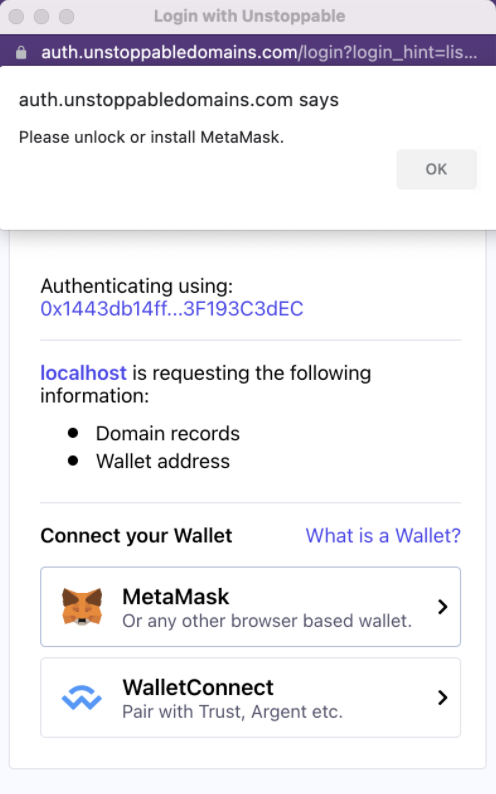

# 5 Minute Guide: Login with Unstoppable with Popup

In this integration guide, we will show how to add Login with Unstoppable with the popup feature to an empty HTML page. There will be no complicated install requirements – to complete this integration, you just need to be a javascript developer with a few minutes of time.


If you’d like to skip ahead or follow along you can download the [full example (1 KB zipped)](https://gist.github.com/perfect-cents/b2a0df5b73b441feb86168a272670565/archive/2463d1538d9e8257e70dc1908e65d95464665fe9.zip) beforehand.&#x20;


## Step 1: Project Setup&#x20;

Before we get started, you’ll need to install Node and Yarn or npm, and create a directory for your project. Then, install the following packages into your app using one of the following scripts:

```shell
mkdir project && cd project
yarn init --yes
yarn add --dev parcel
yarn add @uauth/js
```

Or when using npm run:

```shell
mkdir project && cd project
npm init --yes
npm install --save-dev parcel
npm install --save @uauth/js
```


**@uauth/js** is the library used for implementing Login with Unstoppable on the frontend.


## Step 2: Create an HTML File

Build out the index.html file as follows:


```html
<html>
  <head>
    <title>Login with Unstoppable</title>
  </head>
  <body>
    <button onclick="login()">Login with Unstoppable</button>
    <script type="module" src="app.js"></script>
  </body>
</html>
```


## Step 3: Instantiate the Library&#x20;

Now, configure the app.js as follows:


```javascript
import UAuth from '@uauth/js'

const uauth = new UAuth({
  clientID: 'uauth_example_spa_id',
  clientSecret: 'uauth_example_spa_secret',
  redirectUri: 'http://localhost:5000/callback',
})
```


## Step 4: Implement the Login Handler

Add more code to the app.js file as follows:


```javascript
window.login = async () => {
  try {
    const authorization = await uauth.loginWithPopup()
 
    console.log(authorization)
  } catch (error) {
    console.error(error)
  }
}
```


## Step 5: Login with Unstoppable&#x20;


You need a domain in order to use the Login with Unstoppable feature. If you don’t have a domain, you can mint a [test domain](../../get-test-domain.md#get-a-domain-using-unstoppable-website-faucet) with the self-serve faucet. Or, you can [purchase a domain](https://unstoppabledomains.com) for $5 and mint it to Polygon for free.



**Important:** For Login with Unstoppable integrations, users must use **Polygon Mainnet** or **Ethereum Mainnet** as the network for the domain. Domains minted on Rinkeby Testnet will not work with the Login feature.


The following command will run the app. Keep in mind that the credentials will only work if you are on the correct port.

```shell
yarn parcel --open --port 5000 index.html
```

## Step 6: Add Login UI Requirements

Login with Unstoppable has UI requirements for the UD buttons, user modals, and authenticated user icons. For example, once a user has successfully authenticated, the application's UI should display the user’s domain name (instead of address) to confirm the authorization was successful.&#x20;

Please follow the instructions in the [**Login UI Requirements Guide**](../login-ui-requirements.md) to complete this final step in the integration process.


**Congratulations!** You just implemented Login with Unstoppable.


## Common Error Messages

Here are some of the most common error messages and how to fix them.&#x20;

### **Error: Port "5000" could not be used**

MacOS Monterey (version 12) is already using Port 5000 for the Airplay Receiver, which is the default port used for local development.&#x20;

If you see the following error message on MacOS, you need to turn off AirPlay Receiver in the Sharing preferences or use a different port for local development.

```
lisa@Unstoppable-Lisa login % yarn parcel --port 5000 --open index.html
yarn run v1.22.17
$ /Users/username/workspaces/login/node_modules/.bin/parcel --port 5000 --open index.html
Error: Port "5000" could not be used
    at normalizeOptions (/Users/username/workspaces/login/node_modules/parcel/lib/cli.js:463:15)
    at processTicksAndRejections (node:internal/process/task_queues:96:5)
    at async run (/Users/username/workspaces/login/node_modules/parcel/lib/cli.js:264:17)
error Command failed with exit code 1.
info Visit https://yarnpkg.com/en/docs/cli/run for documentation about this command.
```

### **Error: Please Unlock or Install MetaMask**

If you get an error message to “Please unlock or install MetaMask,” it means you need to install MetaMask within your browser. Alternatively, you can use the browser extension for WalletConnect (or whichever is your preferred wallet).


Grab the MetaMask Chrome Extension




****
